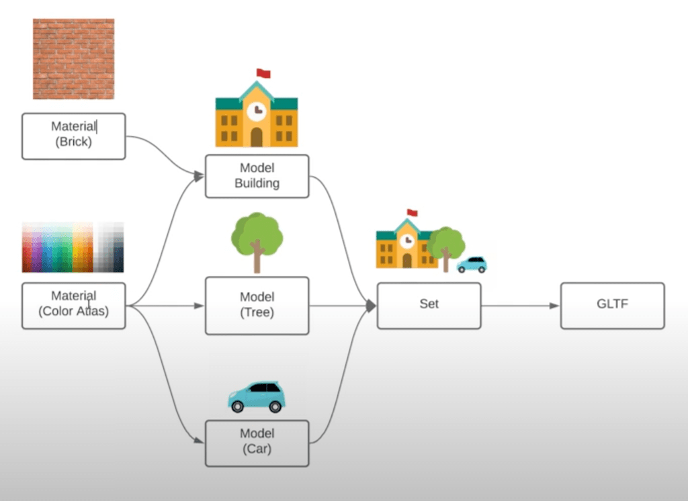
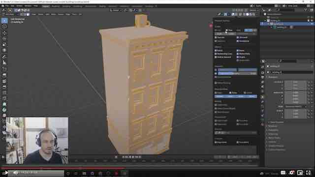

# 3dstreet-assets-source
This repository contains the source files for [3DStreet](https://www.3dstreet.org/), an open-source web-based tool for visualizing safer streets.

This repo contains source files. For production ready assets, see [3DStreet-Assets-Dist](https://github.com/3DStreet/3dstreet-assets-dist) which contains compressed glTF models used in the 3DStreet app and available on our CDN at [assets.3dstreet.app](https://assets.3dstreet.app).

## License for Users
Objects are licensed CC-BY-NC-SA (Creative Commons Non-Commercial Share Alike) unless otherwise noted. See the LICENSE file for details

## License Grant for Contributors
Contributions are welcome to this repo under the following terms. Submitting PRs to this repo are an acknowledgement and agreement to these terms:

By contributing assets to 3DStreet LLC (3DStreet), the Contributor:

a) Retains full ownership of their Contributed Assets

b) Grants to 3DStreet and its successors a worldwide, non-exclusive, perpetual, irrevocable, royalty-free, fully-paid, sublicensable, and transferable license to:

Use, reproduce, modify, adapt, publish, translate, and distribute the Contributed Assets
Create derivative works based on the Contributed Assets
Include the Contributed Assets in the 3DStreet application and related services
License or sublicense the Contributed Assets to third parties
Exercise all rights in any medium now known or later developed
Use the Contributed Assets for any purpose, whether commercial or non-commercial
c) Warrants that they have the legal right to grant such license and that the Contributed Assets do not infringe upon any third-party intellectual property rights

## Installation
Simply clone the repo and work directly on the included Blender files.

## Folder Structure

### Materials
This folder contains .blend files that contain common materials that will be shared across different models. The textures subfolder contains any texture dependencies.

### Models
The models folder contains subfolders for individual assets. Each subfolder contains the .blend and any unique dependencies and resources. These models may contain links to materials from .blend files in the Materials folder if they use any common materials.

### Sets
Sets are .blend files that contain links to collections from blend files in the Models folder. Sets allow multiple models to be exported together for the 3dStreet application efficiently and without duplicated dependencies. The exports folder contains gltf and/or glb files ready for use in the application.

### Diagram

## 3DStreet Modeling Best Practices

### File Setup
* Use Blender 2.92 or later
* make sure to 'load factory settings' before creating new Blender files for the pipeline.
* Purge the model of all orphaned data 

### Object Standards
* Models must be correctly scaled in real-world metric units.
* Models must be oriented so that +Z is up, and they face forward in the -Y direction.
* All static parts of an object should be joined into a single mesh.
* All transforms should be applied and the model origin should be (0,0,0)
* Each object should be placed in its own Collection with the same name. This allows models to be referenced into Set files more easily.

### Geometry Standards
* Vertices should be welded.
* Normals should look correct in Blender viewport. Some models may have 'custom split normal data' that need to be cleared.
* For geometry using normal maps, ensure that no UV islands have a scale of '0' as this causes issues in WebGL renderers.
* Meshes should have just one UV map labeled "UVMap"

### Material Standards
* Remove all materials with solid diffuse colors and replace them with the linked color atlas in the Materials folder. Adjust the UVs as needed to color the mesh as intended.
* Textures specific to the model should go in the model’s textures folder. Atlas textures when appropriate (signage and graphics, non-repeating textures)
* Textures should have power-of-two dimensions and not exceed 2048px. Make textures as small as possible without compromising visual quality. Usually 256-512px is sufficient.

## Dependencies
The Blender files were created in Blender 2.92.0

## Video Tutorial
<a href="https://drive.google.com/file/d/1VuSwrNL567EcYXN6LaNk9FQDwKGFDHTF/view?usp=sharing">

This step-by-step video tutorial</a> by [@mwbeene](https://github.com/mwbeene) is perfect for any level of Blender experience (even beginners) to learn the 3DStreet model pipeline. It can also be useful for other web-based 3d apps outside of 3DStreet.

## Converting glTF to glb with Draco compression

First option is to use the [gltf-pipeline](github.com/CesiumGS/gltf-pipeline) command-line tool from Cesium team.
* Install gltf-pipeline globaly (with -g parameter). Use instruction from https://www.npmjs.com/package/gltf-pipeline?activeTab=readme. Install Node.js if you don't already have it, and then: `npm install -g gltf-pipeline`
* To convert glTF file into glb (with Draco compression) use command: `gltf-pipeline -i model.gltf -o modelDraco.glb -d`

Another option is to use the [gltf-transform](https://gltf-transform.donmccurdy.com/cli.html) command-line tool from Don McCurdy:
* Install gltf-transform globaly (with -g parameter). Follow instructions from https://gltf-transform.donmccurdy.com/cli.html. Install Node.js if you don't already have it, and then:
`npm install --global @gltf-transform/cli`
* To convert glTF file into glb (with Draco compression) use command:
`gltf-transform draco model.gltf modelDraco.glb`

In recent test as of August 2023 gltf-pipeline [resulted in smaller file size](https://github.com/3DStreet/3dstreet-assets-source/issues/68#issuecomment-1700282890)
